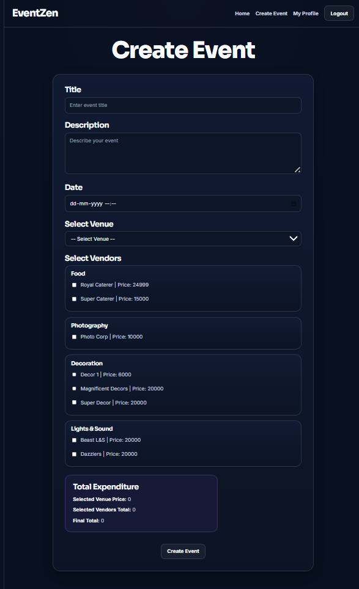
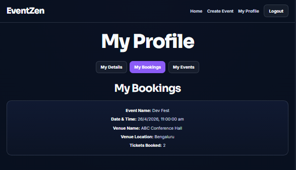
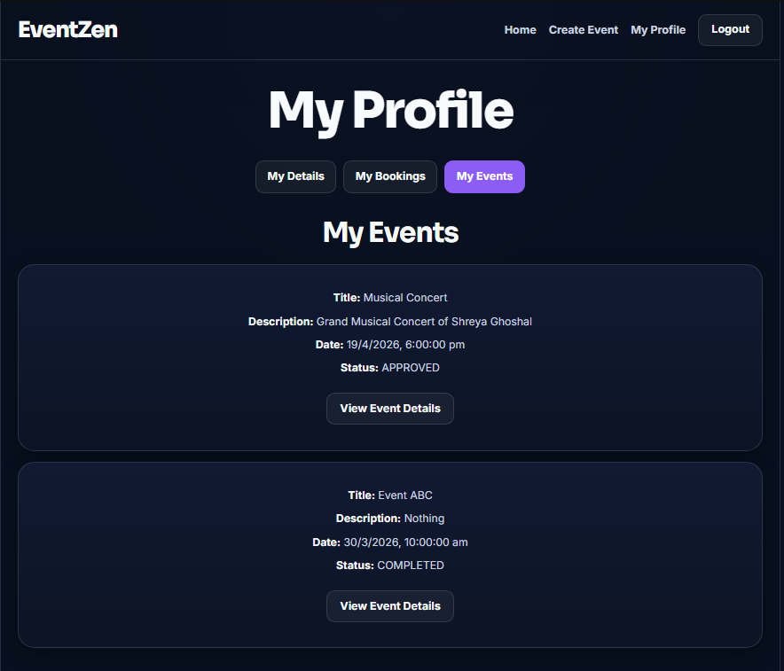
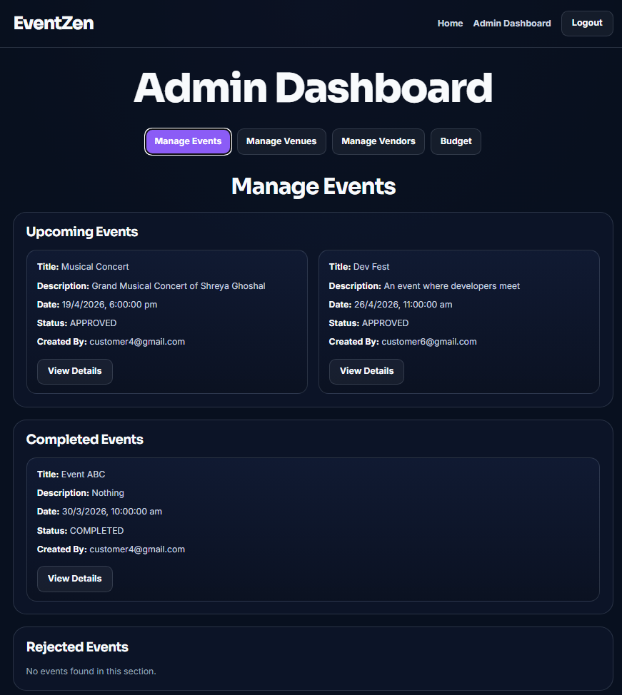
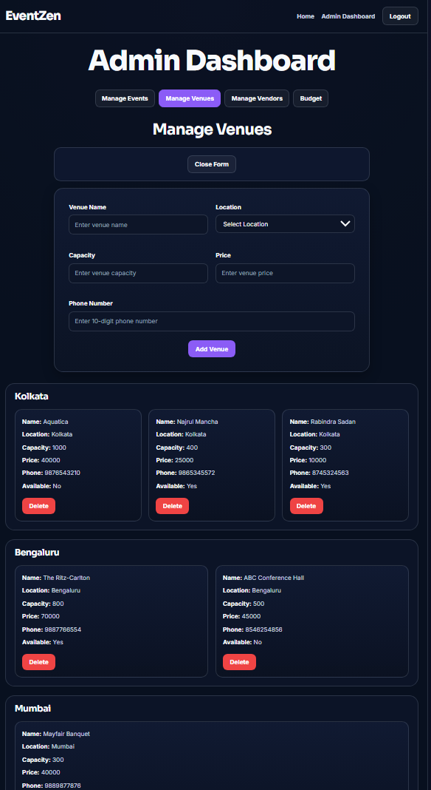

# 🎯 EventZen – Full Stack Event Management System

A modern **full-stack event management platform** built using a **microservices architecture**, designed to demonstrate real-world backend, frontend, and DevOps skills.

---

## 🚀 Overview

**EventZen** allows users to:
- Create and manage events
- Book tickets
- Select venues and vendors
- Track budgets

It includes:
- **Role-based access (Admin & Customer)**
- **JWT Authentication**
- **Microservices backend**
- **Dockerized deployment (One-command setup)**

---

## 🏗️ Tech Stack

### 🔹 Frontend
- React (Vite)
- CSS

### 🔹 Backend
- Spring Boot (Auth Service)
- Node.js + Express (Event Service)
- Sequelize ORM

### 🔹 Database
- MySQL 8

### 🔹 DevOps
- Docker
- Docker Compose

---

## 📁 Project Structure
EventZen/
│
├── auth-service/
├── event-service/
├── eventzen-frontend/
├── mysql-init/
│
├── docker-compose.yml
├── .env.example
├── README.md
└── .gitignore


---

## ✨ Features

### 👤 Customer
- Register & Login
- View events
- Book tickets
- Create events
- Track bookings

### 🛠️ Admin
- Manage venues & vendors
- Approve/reject events

---

## 🔐 Authentication Flow

- JWT generated in **Spring Boot**
- Verified in **Node.js service**
- Used for role-based access

---

## 🐳 Docker Architecture
Frontend (React)
↓
Auth Service (Spring Boot)
↓
MySQL
↑
Event Service (Node.js)


---

## ⚙️ How to Run the Project

### 🔹 Step 1: Clone Repository

```bash
git clone https://github.com/souvikPratihar/EventZen.git
cd EventZen

### 🔹 Step 2: Setup Environment

copy .env.example .env


### 🔹 Step 3: Run using Docker

docker compose up --build


### 🔹 Step 4: Access Application

Service	URL
Frontend	http://localhost:5173

Auth Service	http://localhost:8080

Event Service	http://localhost:5000

---

## 🗄️ Database
Preloaded using:
mysql-init/eventzen_dump.sql

✔ No manual setup required
✔ Data (events, vendors, venues) already present


🔐 Environment Variables

MYSQL_DATABASE=eventzen_auth
MYSQL_ROOT_PASSWORD=root

SPRING_DATASOURCE_URL=jdbc:mysql://mysql:3306/eventzen_auth
SPRING_DATASOURCE_USERNAME=root
SPRING_DATASOURCE_PASSWORD=root

DB_NAME=eventzen_auth
DB_USER=root
DB_PASSWORD=root
DB_HOST=mysql

JWT_SECRET=TXlTdXBlclNlY3JldEtleUZvckpXVFNpZ25pbmdNeVN1cGVyU2VjcmV0S2V5

SERVER_PORT=8080
EVENT_SERVICE_PORT=5000


🔑 Default Admin Login
Email: admin@gmail.com
Password: 1234


📸 Screenshots
🔹 Create Event - by Customer


🔹 Customer Profile - Booked Events


🔹 Customer Profile - Created Events



🔹 Admin Dashboard - Event Management


🔹 Admin Dashboard - Venue Management



⚠️ Important Notes
.env is NOT uploaded (security)
.env.example is used for setup
Docker handles MySQL internally


🧠 Learning Outcomes
Microservices architecture
JWT authentication
Docker deployment
Full-stack integration


👨‍💻 Author

Souvik Pratihar
B.Tech CSE

⭐ Final Note

This project demonstrates:

Real-world architecture
Clean UI/UX
Docker-based deployment